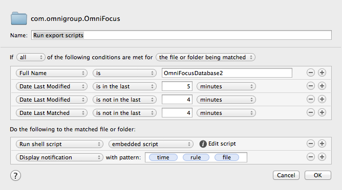
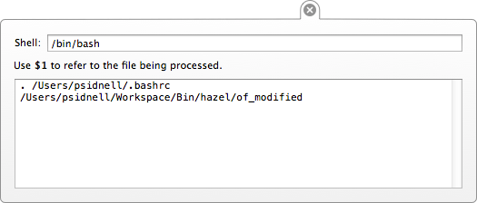

# Hazel Integration

## Rules

Currently OmniFocus keeps it's database in one of two places, depending on how it was purchased:

* Library/Caches/com.omnigroup.OmniFocus/OmniFocusDatabase2
* Library/Caches/com.omnigroup.OmniFocus.MacAppStore/OmniFocusDatabase2

Add the correct path as a watched directory in Hazel and then set up the rules:

Here I have attempted to avoid the rule being run too frequently or too quickly after OmniFocus has saved the file to avoid the script running when I'm doing a lot work in OmniFocus. If the script runs too busily it can slow your machine down and cause OmniFocus problems by holding a lock on it's database for long periods. This recipe seems to be a workable compromise.

## Script

Scripts run from Hazel don't execute in the same environment as your command line and your **$PATH** variable may not be set.

Depending on how your environment is set up, you may need to explicitly source your **.bashrc** (as above) or your **.bash_profile** (if you have one) in the embedded script or any sub-script it's referencing.

Embedding diagnostics in your hazel embedded script to dump the environment might help if you're running into trouble:

        env > ~/Desktop/env.txt
